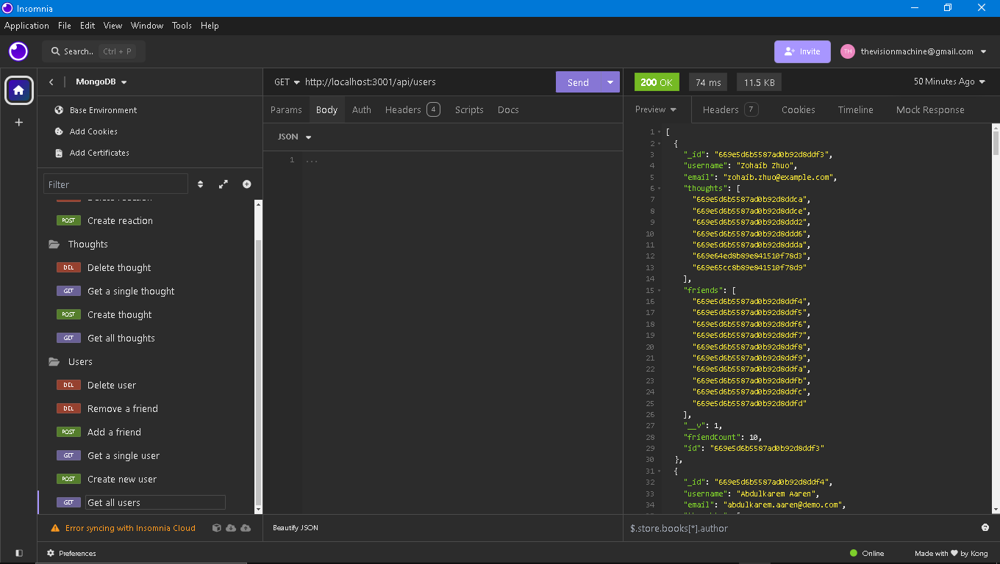
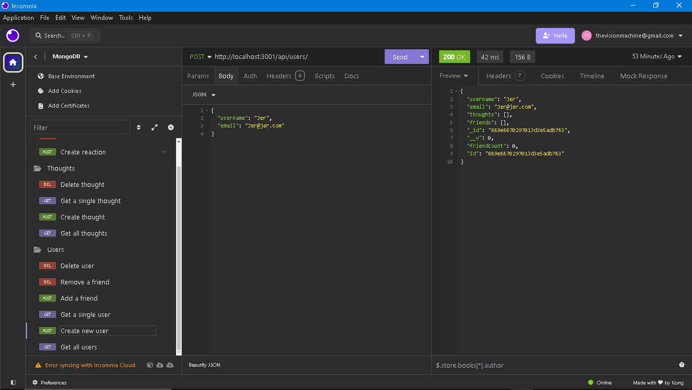
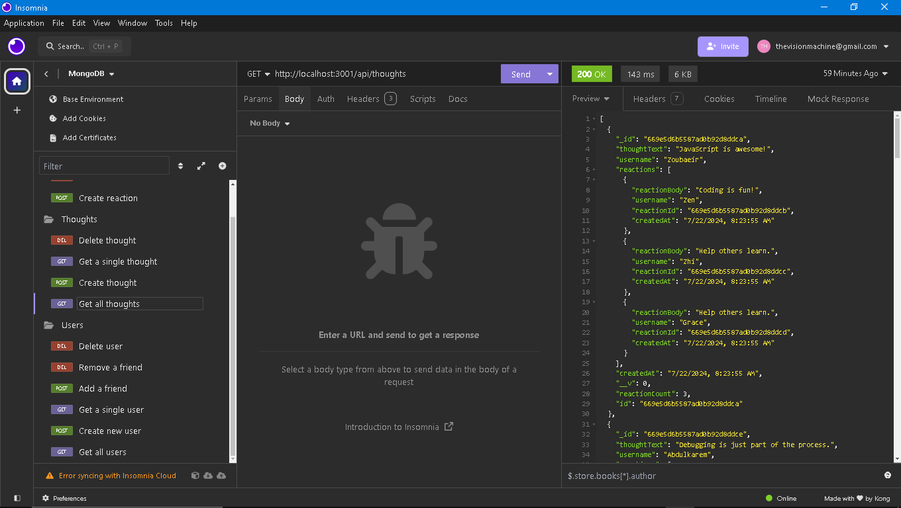
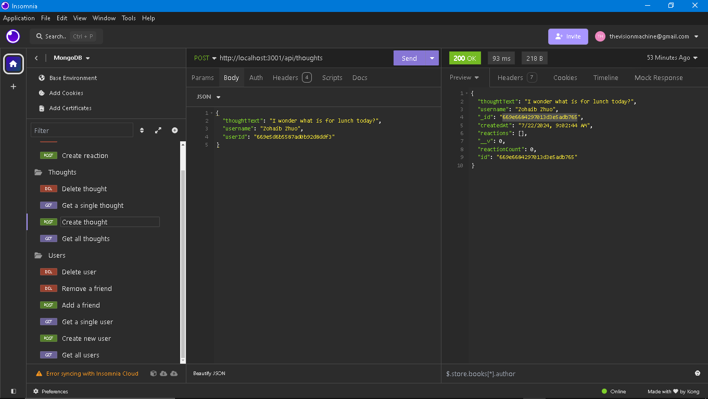

# Social Site Api's
  Back-end api's for a social media using MongoDB 

  
  ## Description
  This app is serves as the backend server complete with api's to save user data to a MongoDB database using Mongoose.
  ## Table of Contents

  1. [Installation](#Installation)
  2. [Usage](#Usage)
  3. [License](#License)
  4. [Questions](#Questions)
  
  ## Usage
  The repository can be cloned from [GitHub](https://github.com/Flem-House-Dev/Social-Site-Api-s).

  Watch this walkthrough video to see it in action: [Walk-Thru](https://drive.google.com/file/d/1VK_9TbriSv8hIWkPYKhx2aoDhzobfDI9/view?usp=sharing)

   

   

   

   

  ***

  ## License
  This software uses the MIT License.
  ## Questions
  To see more projects or to contribute, please visit my GitHub profile at: [Flem-House-Dev](https://github.com/Flem-House-Dev).
